# Project 1 Planning: The Unofficial Guide

> Write this document before you write any pipeline code.
> Your spec and architecture diagram are what you'll use to direct AI tools (Claude, Copilot, etc.) to generate your implementation — the more specific they are, the more useful the generated code will be.
> Update the Retrieval Approach and Chunking Strategy sections if you change your approach during implementation.
> Update this file before starting any stretch features.

---

## Domain

My domain is student reviews of Computer Science professors at Cal Poly Pomona. I chose this because I studied at Cal Poly Pomona for my master’s, and many of the professors in this dataset were my professors or familiar names from the department. Official school pages only show basic course information, but they do not tell students what a professor is actually like day to day. These reviews can help answer questions about grading, workload, exams, attendance, projects, and whether students felt they learned anything useful.

---

## Documents

I collected 10 Rate My Professors review documents about Computer Science professors at Cal Poly Pomona. Each document contains a professor summary plus individual student reviews, course names, ratings, difficulty scores, attendance information, grading comments, and student opinions about lectures, projects, exams, homework, and feedback.

| #  | Source                                     | Description                                                                                                                                          | URL or location                            |
| -- | ------------------------------------------ | ---------------------------------------------------------------------------------------------------------------------------------------------------- | ------------------------------------------ |
| 1  | Yu Sun Rate My Professors reviews          | Reviews about Yu Sun’s CS courses, including CS4680, CS4750, CS4800, CS4990, CS3560, and CS480.                                                      | `data/raw/yu_sun_rmp_reviews.txt`          |
| 2  | Gilbert Young Rate My Professors reviews   | Reviews about Gilbert Young’s CS courses, especially CS3310, CS4310, CS3110, and older CS courses.                                                   | `data/raw/gilbert_young_rmp_reviews.txt`   |
| 3  | Ericsson Marin Rate My Professors reviews  | Reviews about Ericsson Marin’s CS courses, including CS4210, CS4440, CS4250, CS3560, CS5800, and CS1400.                                             | `data/raw/ericsson_marin_rmp_reviews.txt`  |
| 4  | Salam Salloum Rate My Professors reviews   | Reviews about Salam Salloum’s CS courses, including CS3310, CS4350, CS3650, CS3560, CS580, and CS210.                                                | `data/raw/salam_salloum_rmp_reviews.txt`   |
| 5  | David Johannsen Rate My Professors reviews | Reviews about David Johannsen’s CS courses, including CS3560, CS4650, CS4750, CS3650, CS2640, CS1400, and CS2600.                                    | `data/raw/david_johannsen_rmp_reviews.txt` |
| 6  | Xuesong Zhang Rate My Professors reviews   | Reviews about Xuesong Zhang’s CIS and CS-related courses, including CIS1010, CIS3650, GBA6050, and CIS3150.                                          | `data/raw/xuesong_zhang_rmp_reviews.txt`   |
| 7  | Crisrael Lucero Rate My Professors reviews | Reviews about Crisrael Lucero’s CS2600 and CS4310 courses, including student comments about industry experience and difficult but useful coursework. | `data/raw/crisrael_lucero_rmp_reviews.txt` |
| 8  | David Gershman Rate My Professors reviews  | Reviews about David Gershman’s CS2600, CS3800, and CS4310 courses, especially comments about test-heavy grading and difficulty.                      | `data/raw/david_gershman_rmp_reviews.txt`  |
| 9  | Keivan Navi Rate My Professors reviews     | Reviews about Keivan Navi’s CS courses, including CS3650, CS3010, CS4310, CS2640, CS4200, and CS1300.                                                | `data/raw/keivan_navi_rmp_reviews.txt`     |
| 10 | Rick Ramirez Rate My Professors reviews    | Reviews about Rick Ramirez’s CS4080 and CS2400 courses, including comments about presentations, homework, exams, and student support.                | `data/raw/rick_ramirez_rmp_reviews.txt`    |

---

## Chunking Strategy

**Chunk size:**
I will use one full student review as one chunk. I originally considered splitting unusually long reviews around 700 characters, but during testing that created sentence fragments that lost professor and course context.

**Overlap:**
I will not use overlap for normal reviews. Since each review is kept together as a complete chunk, overlap is not needed for this dataset.

**Reasoning:**
My documents are review-heavy, not long textbook-style documents. Each review usually contains one complete student opinion about one professor and course, so splitting in the middle of reviews would make retrieval worse. Keeping each review together helps the system retrieve complete evidence about topics like exams, homework, grading, attendance, lecture quality, difficulty, and whether the professor is helpful. If a review is too long, a small overlap will help preserve context across the split.

---

## Retrieval Approach

**Embedding model:**
I will use `sentence-transformers` with the `all-MiniLM-L6-v2` model. This model runs locally, does not require an API key, and is recommended by the project instructions.

**Top-k:**
I will retrieve the top 5 chunks for each query. This should give the LLM enough context to answer questions using several student reviews without overwhelming it with too much unrelated information.

**Production tradeoff reflection:**
If I were deploying this for real users and cost was not a constraint, I would compare embedding models based on accuracy, context length, latency, and cost. A larger embedding model might understand nuanced student language better, especially slang or mixed positive/negative reviews, but it may be slower and more expensive. I would also consider whether the model handles multilingual reviews, whether it can run locally for privacy, and whether it performs well on short opinion-based text.

---

## Evaluation Plan

| # | Question                                                                                   | Expected answer                                                                                                                                                                                                 |
| - | ------------------------------------------------------------------------------------------ | --------------------------------------------------------------------------------------------------------------------------------------------------------------------------------------------------------------- |
| 1 | Which professor is most often described as having tough or test-heavy grading?             | David Gershman should be identified because many reviews describe his CS2600 classes as test-heavy, quiz-heavy, graded by few things, and difficult.                                                            |
| 2 | Which professor do students praise for industry experience, career advice, mentorship, and practical assignments? | Yu Sun and Crisrael Lucero should both appear. Yu Sun may appear because reviews mention practical lectures, latest technology, job applications, career planning, and mentorship. Crisrael Lucero should also appear because reviews mention industry experience, big tech experience, practical assignments, career advice, and mentorship. |
| 3 | Which professor is commonly described as easy, chill, or lenient?                          | David Johannsen should be a strong answer because many reviews describe his classes as easy, chill, low-stress, flexible with deadlines, and lenient. Yu Sun may also appear for easy project-based courses.    |
| 4 | What do students say about Keivan Navi’s teaching style?                                   | Students often say he is knowledgeable, caring, and passionate, but his lectures can be disorganized or confusing. Many reviews also say participation matters a lot.                                           |
| 5 | Which professor is criticized for slow grading or not grading until late in the semester?  | Ericsson Marin, David Johannsen, and David Gershman may appear, but Ericsson Marin should be included because several reviews specifically mention grading delays or not grading until the end of the semester. |

---

## Anticipated Challenges

1. Some reviews are noisy, informal, or contradictory. For example, one student may describe a professor as very helpful while another student says the same professor is disorganized or difficult. The system may need to summarize disagreement instead of giving a single simple answer.

2. Retrieval may confuse professors who teach similar courses or receive similar comments. For example, several professors are described as lecture-heavy, test-heavy, caring, or easy, so the vector search may retrieve chunks about the wrong professor if the query is too broad.

3. Some source documents have many reviews while others have only a few. Professors with more reviews may dominate retrieval results because there is more text about them, even when a smaller document may contain the best answer.

4. If chunking splits a review away from its course name or professor name, the system may lose source context. To prevent this, each chunk should include the professor name, course, and review text together.

---

## Architecture

```mermaid
flowchart LR
    A[Document Ingestion: local .txt files in data/raw] --> B[Cleaning: remove copied website junk and blank lines]
    B --> C[Chunking: one review per chunk when possible]
    C --> D[Embeddings: sentence-transformers all-MiniLM-L6-v2]
    D --> E[Vector Store: ChromaDB with source metadata]
    E --> F[Retrieval: top 5 relevant chunks per query]
    F --> G[Generation: Groq llama-3.3-70b-versatile]
    G --> H[Grounded answer with cited source files]
```

---

## AI Tool Plan

For the ingestion and cleaning step, I will use ChatGPT to help write a script that loads all `.txt` files from `data/raw`, removes extra blank lines or copied website boilerplate, and preserves useful review information such as professor name, course, date, quality, difficulty, tags, and review text. I will give ChatGPT my Documents section and Chunking Strategy section. I will verify the output by printing one cleaned document and checking whether the useful review text remains.

For the chunking step, I will use ChatGPT to help implement a `chunk_text()` or `load_reviews_as_chunks()` function that keeps each review together as one chunk. I will give ChatGPT my Chunking Strategy section and ask it to avoid splitting in the middle of normal reviews. I will verify the output by printing at least 5 chunks and checking that each chunk includes the professor name, course, and complete review text.

For the embedding and retrieval step, I will use ChatGPT or GitHub Copilot to help write code that embeds chunks with `all-MiniLM-L6-v2`, stores them in ChromaDB, and retrieves the top 5 chunks for a user query. I will give the AI my Retrieval Approach and Architecture sections. I will verify the code by running at least 3 evaluation questions and checking that the returned chunks are relevant and include source metadata.

For the grounded generation step, I will use ChatGPT to help create a prompt template for Groq’s `llama-3.3-70b-versatile`. I will give it the project requirement that the LLM must answer only from retrieved context and include source attribution. I will verify this by asking an out-of-scope question and making sure the system says it does not have enough information instead of making up an answer.

For the interface step, I will use ChatGPT or Copilot to help create a simple Gradio or command-line interface. I will verify that a user can type a question, receive an answer, and see the source files or retrieved chunks used to generate the answer.

